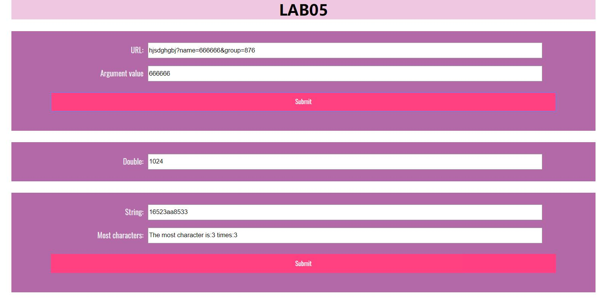

## 使用到的函数：
1、split()分割字符串

2、indexOf()检索字符串中含有的字符

3、for函数遍历

4、setInterval和clearInterval控制函数的执行次数

5、用if和else if进行条件判定
## 具体解决方案
###函数一
先用url.value.split("?")[1]获取url中"?"后的字符串

然后通过queryString.indexOf("=") !== -1)判断字符串中是否有参数，即判断url的合法性

再用split("&")创建参数的字符串数组，将所有参数分离

然后用for函数和split("=")将参数名和参数值分割，判断参数名是否是name，若是则输出name后的参数值。

请补充lab5.js使得网页满足其中注释写明的要求。

基本样式已经实现无需更改，你的任务是lab5.js文件的完成。

###函数二
使用函数stop判定何时进行clearInterval，停止对timeTest的执行

设置参数count，每执行一次函数count+1，达到计算函数运行次数的目的。

###函数三
先建立一个新的数组obj，用于放置出现的字符数目

然后遍历字符串，将字符的次数加入obj中，obj的名称为该字符，如果数组中有这个字符，则值加1，如果数组中没有这个字符，就取默认值1

再用for (let i in obj)遍历数组，得出出现最多的字符和出现的次数。

## 网页效果截图

## github截图

